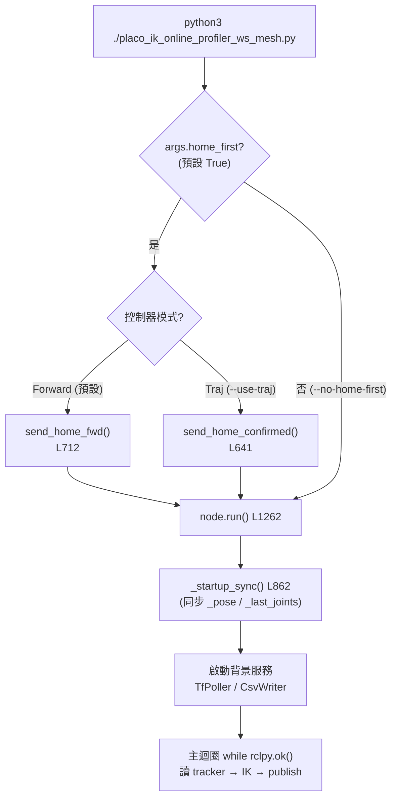
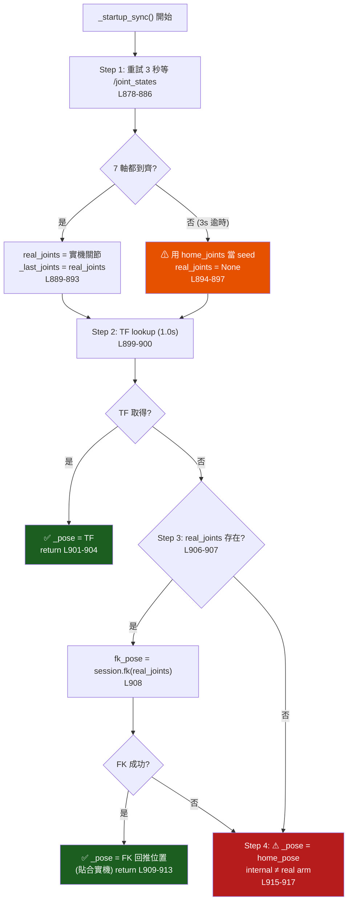
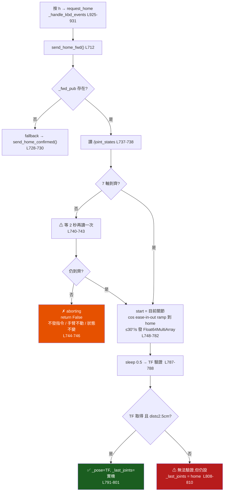
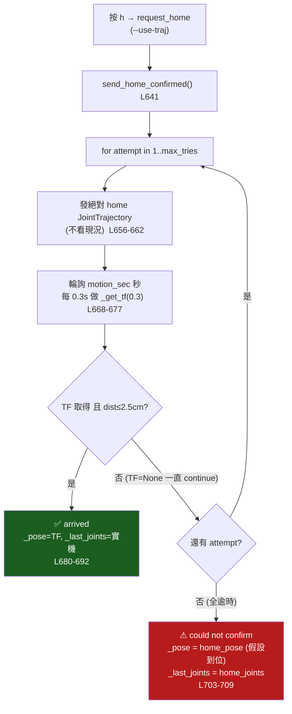

# Placo IK — 啟動同步 & 回 Home 流程圖（2026-05-29）

**對象**：[`placo_ik/ik_node/placo_ik_node.py`](../ik_node/placo_ik_node.py) + [`placo_ik/ik_node/placo_ik_online_profiler_ws_mesh.py`](../ik_node/placo_ik_online_profiler_ws_mesh.py)

本檔說明三件事的程式流程，重點在**沒有 TF / 沒有 joint_states 時各分支的行為**：
1. 程式啟動總流程（home-first → run → `_startup_sync`）
2. `_startup_sync()` 的四層優先級（首步跳動的修法）
3. 執行中按 `h` 回 home：Forward 模式 vs Traj 模式的差異

> Mermaid 圖在 GitHub / VSCode（裝 Markdown Preview Mermaid Support）可直接渲染。

---

## 1. 啟動總流程

profiler 先（可選）回 home，再進 `run()`，`run()` 第一件事是 `_startup_sync()`。

---

## 2. `_startup_sync()` 四層優先級（L862-917）

這是「首步跳動」bug 的修法核心。**Step 3 的 FK 回推**是舊版沒有的關鍵新增。

**讀法**：
- 綠色 = 健康路徑（`_pose` 貼合實機）。
- 橘色 = seed 退回 home_joints（首步可能 guard-clamp 爬行，但不暴衝）。
- 紅色 = 最壞情況：TF 與關節都拿不到 → `_pose=home_pose`，內部認知與實機不符（console 明確警告）。
- **只要 joint_states 在，即使 TF 全掛，Step 3 也能用 FK 把 `_pose` 救回實機位置** → 這就是首步跳動被修掉的原因。

---

## 3. 按 `h` 回 home — Forward 模式（裸指令預設）

`send_home_fwd()` 從「目前關節位置」插值 ramp 到 home。**沒有 joint_states 就算不出起點 → 安全中止,手臂不動。**

**沒 TF + 沒 joint_states 的結果**：走到橘色 `aborting` → **完全不發指令、手臂留在原地、`_pose`/`_last_joints` 不變**（安全失敗）。注意 `_handle_kbd_events` 不檢查回傳值,只會印 `✗ still no joint states — aborting`,迴圈繼續。

---

## 4. 按 `h` 回 home — Traj 模式（`--use-traj`）

`send_home_confirmed()` **不讀 joint_states 算指令**,直接發絕對 home 軌跡(open-loop),再等 TF 確認。

**沒 TF + 沒 joint_states 的結果**：
- 軌跡**照發**(arm 由 JointTrajectoryController 從自己的內部現況插值執行 → 動作本身安全)。
- TF 永遠確認不到 → 重試耗盡 → 紅色 fallback：**`_pose` 被假設成 home_pose**。
- 若控制堆疊真的掛了(joint_states 也斷),軌跡可能根本沒執行,但內部仍記成 home → **內部認知與實機不符**,下一步 teleop 可能有落差(jump_guard 10° clamp 夾成爬行,不暴衝)。

---

## 5. 兩模式對照表（沒 TF + 沒 joint_states 按 h）

| 模式 | 行為 | 手臂 | 內部狀態 | 安全性 |
|---|---|---|---|---|
| **Forward（預設）** | 等 2s → 仍無 → 中止 | 不動 | 不變 | ✅ 安全失敗 |
| **Traj（`--use-traj`）** | 盲發絕對 home 軌跡 → 確認失敗 → 假設到位 | 由控制器插值(若堆疊在) | `_pose=home_pose`(可能 ≠ 實機) | ⚠ 動作安全但認知可能失準 |

**結論**：裸指令是 Forward 模式 → 最壞只是「按 h 沒反應 + 印 aborting + 手臂不動」,不會出事。要小心的是 `--use-traj` 模式,沒 TF 時會 open-loop 回 home 並假設到位,該模式下建議確保 TF/joint_states 正常再按 h。

---

## 相關文件
- 啟動同步/首步跳動已修的脈絡：[`vr_teleop_issues_20260529.md`](./vr_teleop_issues_20260529.md)（舊 issue #1 已不在清單）
- jump guard clamp 爬行行為：同上 #5
